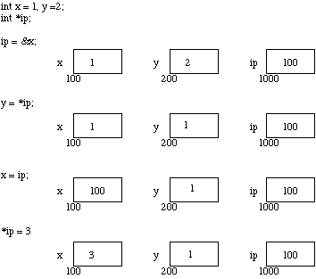

 ## Pointers

Pointers intro from: https://users.cs.cf.ac.uk/Dave.Marshall/C/node10.html

#### What is a pointer
Pointers are a fundamental part of C. A pointer is a variable which contains the address in memory of another variable. We can have a pointer to any variable type. 

The **unary** or **monadic** operator `&` gives the address of a variable.  
The **indirection** or dereference operator `*` gives the contents of an object pointed to by a pointer.  

To declare a pointer to a variable do: 

```int *pointer;```

**NOTE** We must associate a pointer to a particular type: You can't assign the address of a `short int` to a `long int` for instance. 

Consider the effect of the following code:

```c
int x = 1, y = 2;
int *ip;
 
ip = &x;
y = *ip;
x = ip;
*ip = 3;
```
Assume for the sake of this discussion that variable `x` resides at memory location 100, `y` at 200 and `ip` at 1000.  
Note that a pointer is a variable and thus its values need to be stored somewhere.



**IMPORTANT** When a pointer is declared it does not point anywhere. You must set it to point somewhere before you use it.

```c
// will generate an error (program crash!!)
int *ip;
*ip = 100;

// The correct use is
int *ip;
int x;
 
ip = &x;
*ip = 100;
```

A pointer to any variable type is an address in memory which is an integer address. A pointer is definitely NOT an integer. The reason we associate a pointer to a data type is so that it knows how many bytes the data is stored in. When we increment a pointer we increase the pointer by one 'block' memory.

So for a character pointer `++ch_ptr` adds 1 byte to the address.  
For an integer or float `++ip` or `++flp` adds 4 bytes to the address. 

Following example from: http://cslibrary.stanford.edu/106/#c

The pointers x and y are allocated as local variables. The type `int*` means "pointer which points to ints". As Binky learns, the pointers do not automatically get pointees. The pointee for x is dynamically allocated separately with the standard library function malloc(). The syntax `*x` dereferences `x` to access its pointee.

```c
#include <stdio.h>
#include <stdlib.h>

int main() {
    int *x;  // Allocate the pointers x and y
    int *y;  // (but not the pointees)

    x = malloc(sizeof(int));    // Allocate an int pointee,
                                // and set x to point to it
    *x = 42;                    // Dereference x to store 42 in its pointee
    *y = 13;                    // CRASH -- y does not have a pointee yet
    y = x;                      // Pointer assignment sets y to point to x's pointee
    *y = 13;                    // Dereference y to store 13 in its (shared) pointee

    printf("%p\n", x);          // 0x7fc309c027e0
    printf("%p\n", y);          // 0x7fc309c027e0
    
    printf("%d\n", *x);         // 13
    printf("%d\n", *y);         // 13
}
```
